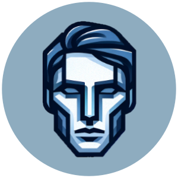

<h1 style="text-align: center;">

 
🧒 FaceCraft 🧑
</h1>

FaceCraft is a realistic face generator engineered using a StyleGan2 architecture.

FaceCraft's repository lets you train the model yourself or generate a face from a saved checkpoint locally.

Generate a face on our HuggingFace space: <a href="https://huggingface.co/spaces/FaceCraft/FaceCraft" target="_blank">FaceCraft</a>

<h2 style="text-align: center;">⚙️ Features ⚙️</h2>
<ul>
<li>High-Resolution Image Generation: Generate images at different resolutions by adjusting the `LOG_RESOLUTION` setting.</li>
<li>Noise Mapping and Style Injection: Implements a noise mapping network and uses style vectors to modulate the weights in the convolution layers.</li>
<li>Gradient Penalty and Path Length Penalty: Includes implementations for WGAN-GP loss and perceptual path length regularization to stabilize training.</li>
<li>Checkpointing: Supports saving and loading model checkpoints to resume training or perform inference at various stages.</li>
</ul>

<h2 style="text-align: center;">🌐 Requirements 🌐</h2>

NVIDIA Drivers

Install python 3.11.9+

Install Docker

Install Flickr-Faces-HQ Dataset: <code>pip install kaggle && kaggle datasets download -d rahulbhalley/ffhq-1024x1024</code>

Unzip the images. Images should be organized into subdirectories representing different classes if using `ImageFolder`.

Clone the Repository: <code>git clone https://github.com/EthanStanks/FaceCraft</code>

<h2 style="text-align: center;">🔨 Training with Docker 🔨</h2>

Build the docker image (takes 10 minutes)

+ <code>docker build -f Dockerfile_Train -t facecraft-train:1.1 .</code> +

Run the container

+ <code>docker run --gpus all -it -d -e DISPLAY=$DISPLAY -p 6006:6006 -v ${PWD}:/app facecraft-train:1.1</code> +

Open Visual Studio Code

(Optional) Install Python Extension

Attach Current Window to Container

+ <code>Click the "Attach in Current Window" arrow next to "facecraft-train:1.1"</code> +

Navigate to the app directory

+ <code>cd ../app</code> +

Run the Training Script

+ <code>python Training/src/train.py</code> +

<h2 style="text-align: center;">💻 Generating with Docker 💻</h2>

Instructions coming soon

<h2 style="text-align: center;">📸 Dataset 📸</h2>

The Flickr-Faces-HQ Dataset (FFHQ) was used to train and test the GANs and Discriminator models with over 70,000 images of faces. FFHQ Dataset can be found here: <a href="https://github.com/NVlabs/ffhq-dataset" target="_blank">Flickr-Faces-HQ Dataset</a>

<h2 style="text-align: center;">👩‍💻 Developers 👨‍💻</h2>
<ul>
<li><a href="https://www.linkedin.com/in/williamhoover70/" target="_blank">Will Hoover</a></li>
<li><a href="https://www.linkedin.com/in/temitayo-shorunke-a520991b5/" target="_blank">Temitayo Shorunke</a></li>
<li><a href="https://www.linkedin.com/in/ethan-stanks/" target="_blank">Ethan Stanks</a></li>
</ul>

<h2 style="text-align: center;">👩‍🏫 Acknowledgment 👨‍🏫</h2>

Special thank you to these individuals who helped us along the way!

<ul>
<li>Rebecca Carroll</li>
<li>Chad Gibson</li>
<li>Philip Smith</li>
</ul>

<h2 style="text-align: center;">⚖️ License ⚖️</h2>

This project is open-sourced under the MIT license. See the LICENSE file for more details.

<h2 style="text-align: center;">✍️ Project Status✍️ </h2>

The FaceCraft team is finished with the project. Check out each of our blogs if you'd like to read about our 5 months of work:

<ul>
<li><a href="https://www.willhoover.dev/" target="_blank">Will's Blog</a></li>
<li><a href="https://analyticalgeniuski.wixsite.com/temitayo-s-portfolio/blog" target="_blank">Temitayo's Blog</a></li>
<li><a href="https://ethanstanks.github.io/capstone_blogs/capstone_blogs.html" target="_blank">Ethan's Blog</a></li>
</ul>
